# Voorstel voor een nieuwe structuur

Dit is een voorstel voor de **indeling** (informatie-architectuur) van de nieuwe site, nog geen
ontwerp. Het beschrijft welke hoofdingangen er zijn, wat eronder valt, waar de huidige inhoud
naartoe gaat, en welke nieuwe functies (inschrijven, educatie, beheer) daarin passen.

## 1. Uitgangspunten

1. **Indelen op bezoekersdoel, niet op interne organisatie.** Iemand komt om iets te bezoeken,
   iets op te zoeken, iets te lezen, iets aan te vragen of lid te worden.
2. **Eén site, één uiterlijk.** Collecties (nu ZCBS) en het Geheugen van Heemskerk worden
   onderdeel van de nieuwe app in plaats van losse werelden.
3. **De agenda is de belangrijkste ingang** en krijgt online inschrijven met wachtlijst.
4. **Educatie wordt een eigen hoofdonderdeel** met een pagina per activiteit en een aanvraagknop.
5. **Zoeken in de collecties staat niet meer op de homepage**, maar is vanaf elke pagina met één
   klik bereikbaar (menu-item plus een duidelijk blok op de homepage).
6. **Zo min mogelijk niveaus:** maximaal twee niveaus diep in het menu; alles wat een bezoeker
   vaak nodig heeft is vanaf de homepage in één klik bereikbaar.
7. **Eén bron per gegeven.** Contributie, openingstijden en adres staan op één plek in het
   beheer en worden overal daaruit getoond.

## 2. Hoofdindeling (schema)

```
                         ┌──────────────────────────────────┐
                         │             HOMEPAGE             │
                         └──────────────────────────────────┘
                                          │
   ┌──────────┬──────────┬────────────────┼──────────────┬────────────┬─────────────┐
   ▼          ▼          ▼                ▼              ▼            ▼             ▼
 AGENDA     NIEUWS    ONTDEK          COLLECTIES      EDUCATIE     VERENIGING   [LID WORDEN]
                      HEEMSKERK       (zoeken)                                   (knop)
   │          │          │                │              │            │
   │          │          │                │              │            ├ Over de HKH
   ├ Komende  ├ Berichten├ Kastelen       ├ Zoeken in    ├ Lesaanbod  ├ Bestuur
   │ activi-  ├ Nieuws-  │  (kaart +      │  alle        │  (per      ├ Werkgroepen & meedoen
   │ teiten   │  brieven │   9 kastelen)  │  collecties) │  activiteit)├ Historisch Huis
   ├ Inschrij-├ Heems-   ├ Gebouwen &     ├ Vraag het    ├ Voor       │  (openingstijden, adres)
   │  ven +   │  kring   │  monumenten    │  archief     │  scholen:  ├ Heemsstichting
   │  wacht-  │          ├ Personen       │  (AI)        │  aanvragen ├ Uitgaven & winkel
   │  lijst   │          ├ Verhalen &     ├ Mijn         ├ Werkgroep  ├ ANBI & documenten
   ├ Terugblik│          │  herinneringen │  dossiers    │  educatie  ├ Contact
   ├ Kalender-│          │  (Geheugen)    │  (login)     │            └ Links
   │  abonnem.│          ├ Exposities     └ Collectie-   │
   └ Historisch         └ Over Heemskerk    uitleg       │
     Huis open                                            │
```

Mermaid-versie (rendert op GitHub):

```mermaid
flowchart TB
  H[Homepage]
  H --> A[Agenda]
  H --> N[Nieuws]
  H --> O[Ontdek Heemskerk]
  H --> C[Collecties]
  H --> E[Educatie]
  H --> V[Vereniging]
  H --> L([Lid worden])

  A --> A1[Komende activiteiten]
  A --> A2[Activiteit: inschrijven / wachtlijst]
  A --> A3[Terugblik / eerdere activiteiten]
  A --> A4[Kalender-abonnement]
  A --> A5[Historisch Huis open: maandagmiddag]

  N --> N1[Berichten]
  N --> N2[Nieuwsbrieven]
  N --> N3[Heemskring magazine]

  O --> O1[Kastelen + kaart]
  O --> O2[Gebouwen en monumenten]
  O --> O3[Personen]
  O --> O4[Verhalen en herinneringen]
  O --> O5[Exposities]
  O --> O6[Over Heemskerk]

  C --> C1[Zoeken in alle collecties]
  C --> C2[Vraag het archief - AI]
  C --> C3[Mijn dossiers]
  C --> C4[Over de collecties]

  E --> E1[Lesaanbod per activiteit]
  E --> E2[Aanvragen]
  E --> E3[Werkgroep Educatie]

  V --> V1[Over de HKH]
  V --> V2[Bestuur]
  V --> V3[Werkgroepen en meedoen]
  V --> V4[Historisch Huis]
  V --> V5[Heemsstichting]
  V --> V6[Uitgaven en winkel]
  V --> V7[ANBI en documenten]
  V --> V8[Contact]
  V --> V9[Links]
```



Zes inhoudelijke hoofdingangen plus een opvallende knop "Lid worden". Het menu is altijd
zichtbaar op desktop; op mobiel een hamburgermenu met dezelfde items.

**Aanvulling 9 oktober 2026 (besluit Robbert):** het Geheugen van Heemskerk wordt een zevende
hoofdingang (zie 3.8), en onderdelen met meerdere ingangen krijgen een **submenubalk** onder het
hoofdmenu. Die balk is geen uitklapmenu: hij staat onder het hoofdmenu en blijft staan zolang de
bezoeker binnen dat onderdeel is, met het actieve subitem gemarkeerd. Alleen waar nodig:

| Hoofditem | Submenubalk |
|---|---|
| Nieuws | Berichten · Nieuwsbrieven · Heemskring |
| Ontdek Heemskerk | Kastelen · Gebouwen en monumenten · Personen · Verhalen · Exposities |
| Geheugen van Heemskerk | Alle verhalen · Thema's · Buurten · Over het project |
| Collecties | Overzicht · Zoeken in de collecties · Onderzoek |
| Vereniging | Over de HKH · Bestuur · Werkgroepen · Historisch Huis · Uitgaven · ANBI · Contact |

Agenda en Educatie hebben geen submenubalk. Een hoofditem met submenubalk opent direct het
eerste subitem (Vereniging opent Over de HKH, Ontdek Heemskerk opent Kastelen); er zijn geen
aparte overzichtspagina's per hoofditem. De ondertitel in de kop is "Vereniging voor de
geschiedenis van Heemskerk", zodat de naam Geheugen van Heemskerk alleen nog de verhalen
aanduidt. Het oprichtingsjaar 1988 wordt alleen genoemd bij Over de HKH: de site gaat over de
hele geschiedenis van Heemskerk, niet over die sinds de oprichting.

## 3. Per hoofdonderdeel

### 3.1 Agenda

De belangrijkste ingang. Doel: in één oogopslag zien wat er komt en je direct inschrijven.

| Onderdeel | Inhoud |
|---|---|
| Overzicht | chronologische lijst van komende activiteiten met datum, tijd, titel, locatie, soort (lezing, film, wandeling, expositie, ledenvergadering, extern), prijs, en status (plaatsen vrij / nog N plaatsen / vol, wachtlijst). Filter op soort en op "alleen HKH" of "ook van partners". |
| Activiteitpagina | tekst, afbeelding, datum/tijd, locatie met kaart, organisator (werkgroep), prijs (leden/niet-leden), capaciteit, **inschrijfformulier**, toevoegen aan kalender, deel-link. |
| Inschrijven | naam, e-mail, aantal personen (max. instelbaar), lid ja/nee, opmerking. Direct een bevestigingsmail met een afmeldlink. Teller loopt automatisch; bij vol → inschrijven op **wachtlijst**; bij een afmelding schuift de eerste op de wachtlijst automatisch door en krijgt een mail. Instelbaar: inschrijfdeadline, maximum per inschrijving, wel/niet inschrijven nodig (bv. exposities), externe inschrijf-URL (voor activiteiten van partners). |
| Terugblik | afgelopen activiteiten blijven bereikbaar (verslag, foto's, eventueel film). Vervangt de nieuwsberichten die nu kopieën van agenda-items zijn. |
| Kalender-abonnement | iCal/Google/Outlook zoals nu. |
| Vaste momenten | "Historisch Huis open: elke maandag 14.00-16.00" en het ritme (1e en 3e vrijdagmiddag, 4e dinsdagavond) als vast blok boven de lijst. |

### 3.2 Nieuws

| Onderdeel | Inhoud |
|---|---|
| Berichten | echt nieuws (podcast, nieuwe aanwinst, vernieuwde site, partnernieuws). Aankondigingen van activiteiten horen in de Agenda; een bericht kan wel naar een activiteit linken. |
| Nieuwsbrieven | overzicht per nummer met datum, korte inhoud en PDF. |
| Heemskring | eigen pagina voor het magazine: wat het is, laatste nummer met omslag en inhoudsopgave, archief van nummers, link naar de artikelen in de collectie (artikelenbank), hoe te verkrijgen (leden gratis, losse verkoop). |

### 3.3 Ontdek Heemskerk

Alles wat nu onder "Publicaties" en deels onder "Collecties" staat: de leesbare verhalen.

| Onderdeel | Inhoud (bestaand) |
|---|---|
| Kastelen | kaart + De Vlotter, Marquette, 't Hoge Werfje, Poelenburg, Rietwijk/Reewijk, Assumburg, Beijerlust, Oud Haerlem, Meeresteijn |
| Gebouwen en monumenten | Dorpskerk en kerkhof, Laurentiuskerk, Fort Veldhuis, Huldtoneel, Historisch Huis (St. Mariaschool) |
| Personen | Maerten van Heemskerck (later uit te breiden: burgemeester Nielen, Piet Diemeer, …) |
| Verhalen en herinneringen | Heemskerker ezels, en het **Geheugen van Heemskerk** (de honderden herinneringsverhalen) overgezet met filters thema / buurt / auteur |
| Exposities | overzicht van gehouden exposities met fotoreeks (Deutzstraat, 25 jaar HKH-panelen, Heemskerk en WO II, Museumschuur Piet Diemeer, …) |
| Over Heemskerk | de ontstaansgeschiedenis |

Elke verhaalpagina krijgt onderaan "Meer in de collecties over dit onderwerp" (een
voorgevulde zoekopdracht), zodat Ontdek en Collecties elkaar versterken.

### 3.4 Collecties (zoeken)

De bestaande zoekpagina van de testapp (archief, beeldbank, bibliotheek, bidprentjes, artikelen,
objecten, filters, uitgebreid zoeken, galerij/lijst) plus "Vraag stellen" (AI) en dossiers.

| Onderdeel | Inhoud |
|---|---|
| Zoeken in alle collecties | de huidige `/#/zoeken` |
| Vraag het archief | AI-vraag met bronnen, PDF-export, vervolgvragen |
| Mijn dossiers | na inloggen: dossiers, feitenlijst, artikelen, delen |
| Over de collecties | per collectie: wat zit erin, hoeveel, hoe aanleveren (foto's, bidprentjes, voorwerpen), "ik wil een foto laten afdrukken" |

Vanaf de homepage één prominent blok "Zoek in 18.000 foto's, documenten, boeken en
bidprentjes" met een zoekveld dat direct naar de zoekpagina gaat, en een tweede knop "Stel een
vraag aan het archief". De sitezoekfunctie in de header doorzoekt pagina's én collecties.

### 3.5 Educatie

Eigen hoofdingang voor scholen en ouders. Inhoud uit `Lesaanbod-HKH.pdf`, als pagina's in
plaats van een PDF.

| Onderdeel | Inhoud |
|---|---|
| Overzicht | korte inleiding (kerndoelen, voor wie), kaarten per activiteit met groep, duur, kosten |
| Per activiteit | omschrijving, doelgroep (groepen), koppeling kerndoelen, duur en voorbereiding, uitvoering (HKH of school zelf), kosten, contactpersoon, **knop "Aanvragen"** |
| Aanvragen | formulier: school, groep, aantal leerlingen, gewenste periode, contactpersoon; komt bij de werkgroep educatie binnen en is in het beheer te volgen |
| Downloads | lesmateriaal en de PDF-brochure blijven downloadbaar |
| Nieuws voor scholen | jaarlijkse uitnodiging, jaarlijkse Maerten-activiteit, tentoonstellingen van leerlingwerk |
| Werkgroep Educatie | wie, samenwerking met Museum Kennemerland en Cultuurhuis, meedoen |

Activiteiten nu: rondleidingen Assumburg/Marquette, Heemskerk in oorlogstijd, historische
wandelingen rond scholen, "Beroemd als Maerten", workshops (monumentenkist, archeologie,
familiegeschiedenis), jaarlijkse Maerten-dag.

### 3.6 Vereniging

Alles over de organisatie, nu verspreid over "Informatie" en "Activiteiten + Nieuws".

| Onderdeel | Inhoud |
|---|---|
| Over de HKH | doel, geschiedenis sinds 1988, ledental, wat we doen |
| Bestuur | bestuursleden met foto, functie, contact, motivatie |
| Werkgroepen en meedoen | per werkgroep een korte kaart (wat, wie, wanneer, contact) plus "Vrijwilliger worden" |
| Historisch Huis | adres, openingstijden, route, wat je er kunt doen, geschiedenis van het pand |
| Heemsstichting | eigen pagina met juiste titel |
| Uitgaven en winkel | Heemskring, boeken, DVD's, wandelingen, foto bestellen; per uitgave prijs leden/niet-leden en hoe te verkrijgen; later eventueel online bestellen |
| ANBI en documenten | financiële verslagen, begroting, beleidsplan, statuten/WBTR, privacyreglement, integriteitsregeling, disclaimer, één keer elk |
| Contact | formulier met keuze ontvanger, telefoon, adres, kaart, socials |
| Links | partnerorganisaties |

### 3.8 Geheugen van Heemskerk

Eigen hoofdingang met de 174 herinneringen die tussen 2005 en 2010 door verhalenverzamelaars
van Welschap Welzijn zijn opgetekend en sinds 2012 bij de HKH liggen.

| Onderdeel | Inhoud |
|---|---|
| Alle verhalen | kaarten met foto, thema, buurt en verteller; zoeken op titel of verteller; filter op verhalenverzamelaar; thema-chips |
| Thema's | twaalf thema's met aantallen (straat en buurt, school, werk, verdwenen plekken, …) |
| Buurten | vijf buurten met aantallen |
| Verhaal | verteller ("Aan het woord"), periode, inleiding, foto's met bijschrift, tekst, verhalenverzamelaar, bijpassende verhalen |
| Over het project | ontstaan, Welschap, overdracht aan de HKH, zelf een verhaal aanleveren |

De rubriek Verhalen onder Ontdek Heemskerk houdt de HKH-verhalen (Heemskerker ezels, Over
Heemskerk) en verwijst naar het Geheugen.

### 3.7 Lid worden (knop, altijd zichtbaar)

Eén pagina: waarom lid, wat je krijgt (Heemskring, nieuwsbrief, ledenprijs, ledenvergadering),
contributie (één bedrag, uit het beheer), aanmeldformulier zoals nu. Later: online betalen en
een ledenlogin voor adreswijziging en voorkeuren.

## 4. Homepage-indeling (alleen structuur)

1. **Kop**: logo, vast menu (zes items), zoekveld, knop "Lid worden".
2. **Intro**: één zin wat de HKH is, met drie knoppen: *Bekijk de agenda*, *Zoek in de
   collecties*, *Word lid*.
3. **Komende activiteiten**: de eerstvolgende drie, elk met datum, titel, status
   (plaatsen/vol) en knop "Inschrijven"; link "Hele agenda".
4. **Zoek in de collecties**: zoekveld + "Stel een vraag aan het archief".
5. **Nieuws**: laatste drie berichten; link "Al het nieuws".
6. **Ontdek Heemskerk**: drie of vier uitgelichte verhalen (bv. kastelenkaart, Maerten, Geheugen).
7. **Voor scholen**: kort blok met link naar Educatie.
8. **Praktisch**: Historisch Huis open maandag 14.00-16.00, adres, kaartje, contact.
9. **Voet**: menu-herhaling, socials, ANBI/privacy/disclaimer.

De "In de spotlight"-kaart blijft mogelijk als beheerbaar blok (bv. nieuw boek, expositie),
maar de homepage vult zich verder automatisch uit agenda, nieuws en verhalen.

## 5. Waar gaat de huidige inhoud naartoe

| Nu | Nieuw |
|---|---|
| Informatie → Over Heemskerk | Ontdek Heemskerk → Over Heemskerk |
| Informatie → Over HKH, Bestuursleden, Historisch Huis, Heemsstichting, Contact, Lid worden | Vereniging (Lid worden ook als knop) |
| Informatie → ANBI (financiën, beleidsplan, disclaimer, privacy) | Vereniging → ANBI en documenten |
| Activiteiten + Nieuws → Openstelling Historisch Huis | Agenda (vast blok) + Vereniging → Historisch Huis |
| Activiteiten + Nieuws → Werkgroepen | Vereniging → Werkgroepen en meedoen; Educatie-deel naar Educatie |
| Activiteiten + Nieuws → Alle berichten | Nieuws → Berichten (aankondigingen worden agenda-items) |
| Activiteiten + Nieuws → Nieuwsbrieven | Nieuws → Nieuwsbrieven |
| Activiteiten + Nieuws → Kalender | Agenda |
| Publicaties → Heemskring (leeg) | Nieuws → Heemskring + Vereniging → Uitgaven |
| Publicaties → Wetenswaardigheden | Ontdek Heemskerk → Gebouwen / Personen / Verhalen |
| Publicaties → Kastelen | Ontdek Heemskerk → Kastelen |
| Collecties → Beeldbanken (ZCBS) | Collecties → Zoeken in de collecties (nieuwe zoekpagina); de AI-vraag heet Onderzoek |
| Collecties → Exposities | Ontdek Heemskerk → Exposities |
| Collecties → Geheugen van Heemskerk | Geheugen van Heemskerk (eigen hoofdingang, alle 174 verhalen overgenomen) |
| Webshop | Vereniging → Uitgaven en winkel (en homepage-spotlight) |
| Links | Vereniging → Links (en voet) |
| nav-* stubpagina's en de 16 niet-bereikbare pagina's (hoofdstuk 6 van de inventarisatie) | vervallen |
| Lesaanbod-HKH.pdf | Educatie (pagina's) + download |

Oude URL's krijgen een doorverwijzing naar de nieuwe plek, zodat links in nieuwsbrieven en
zoekmachines blijven werken. De ZCBS-links (`/cgi-bin/*.pl`) verwijzen naar de nieuwe
zoekpagina met de juiste collectie voorgeselecteerd.

## 6. Nieuwe functies in dit voorstel

1. **Online inschrijven met wachtlijst** voor activiteiten (zie 3.1).
2. **Educatie als eigen onderdeel** met aanvraagformulier (zie 3.5).
3. **Eén zoekveld** dat pagina's en collecties doorzoekt.
4. **Geheugen van Heemskerk en exposities** in dezelfde vormgeving als de rest.
5. **Heemskring-pagina** met koppeling naar de artikelenbank.
6. **Beheerpagina** (hieronder).

## 7. Beheer (admin) – scope voor later

De bestaande `frontend-admin` (met modules auth, news, collection, config, ai) wordt uitgebreid.
Alleen accounts op `HKH_ADMIN_ALLOWED_EMAILS`, met later rollen (beheerder, redacteur,
werkgroep).

| Beheeronderdeel | Wat je kunt doen |
|---|---|
| Activiteiten | aanmaken/wijzigen/publiceren, soort, locatie, organisator, prijs, capaciteit, inschrijven aan/uit, deadline, externe link; **inschrijvingen en wachtlijst** inzien, handmatig toevoegen/verwijderen, exporteren (CSV), mail naar alle inschrijvers, verslag/foto's toevoegen na afloop |
| Berichten | nieuws schrijven, afbeelding, publicatiedatum, koppelen aan activiteit |
| Nieuwsbrieven en Heemskring | nummer, datum, korte inhoud, PDF/omslag uploaden |
| Verhalen (Ontdek) | pagina's per rubriek met tekst en afbeeldingen, "meer in de collecties"-zoekopdracht |
| Educatie | lesaanbod per activiteit, aanvragen inzien en afhandelen |
| Vereniging | bestuursleden, werkgroepen, openingstijden en sluitingsdagen, adres, contributie, contactontvangers |
| Uitgaven | producten met prijzen en beschikbaarheid |
| Homepage | spotlight-blok en uitgelichte verhalen kiezen |
| Links | partnerlinks |

## 8. Besluiten (Robbert, 9 oktober 2026)

De structuur hierboven is akkoord. Alle bestaande teksten worden 1-op-1 overgenomen.

| Vraag | Besluit |
|---|---|
| 1. Contributie | € 18,75 per jaar; één bron in het beheer |
| 2. Geheugen van Heemskerk | de verhalen worden overgezet in de nieuwe vormgeving |
| 3. Lege expositie-items | geen bronnen voor de vier lege items; die vervallen. Nieuwe exposities moeten kunnen worden toegevoegd |
| 4. Online verkoop | nee; uitgaven blijven af te halen in het Historisch Huis |
| 5. Ledenlogin | nee; "lid ja/nee" blijft een vinkje op het inschrijfformulier |
| 6. Collecties | de collecties blijven en worden ontsloten zoals nu al in de HKH-testapp (zoekpagina, filters, AI-vraag); de publieke ZCBS-ingang vervalt |
| 7. Beheerrollen | geen vaste rollen per werkgroep maar permissies per beheerder: wie in het beheer mag inloggen krijgt per onderdeel (agenda, inschrijvingen, nieuws, …) een permissie |

## 9. Aanpak in twee fasen

**Fase 1: werkende site met vaste inhoud (POC).** Eerst wordt de complete nieuwe site gebouwd
met alle teksten, agenda-items, nieuws en verhalen als vaste inhoud, zonder beheerpagina.
Daarmee kan iedereen de echte site doorklikken en beoordelen wat mooi is en wat anders moet.
De bestaande zoek-, AI- en dossierfuncties van de testapp maken er gewoon deel van uit.

**Fase 2: inhoud uit de database plus beheer.** Als de site is goedgekeurd worden agenda,
inschrijvingen met wachtlijst, nieuws, nieuwsbrieven, verhalen, exposities, educatie-aanvragen
en verenigingsgegevens in de database gezet, met een beheerpagina met permissies per
onderdeel.

Randvoorwaarde voor fase 1, zodat fase 2 geen herbouw wordt: de vaste inhoud staat in aparte
inhoudsbestanden (één per soort: activiteiten, berichten, verhalen, bestuursleden, …) in
hetzelfde datamodel dat fase 2 gebruikt, niet verspreid door de schermen. In fase 2 wisselt dan
alleen de bron (bestand → API), de schermen blijven.
